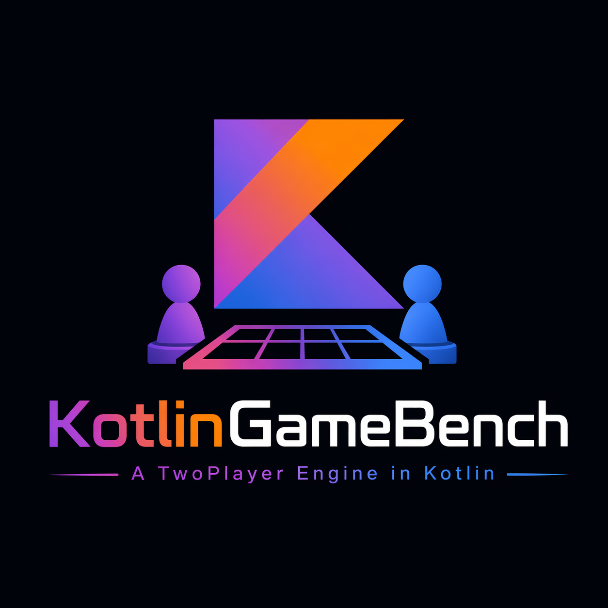
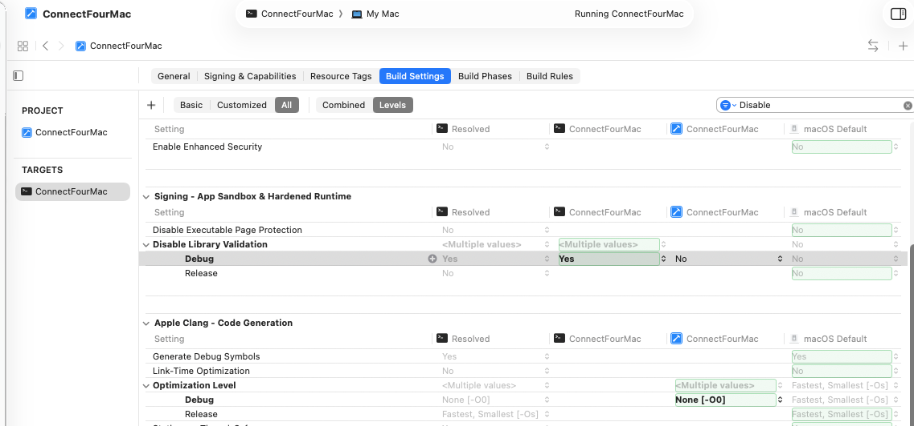
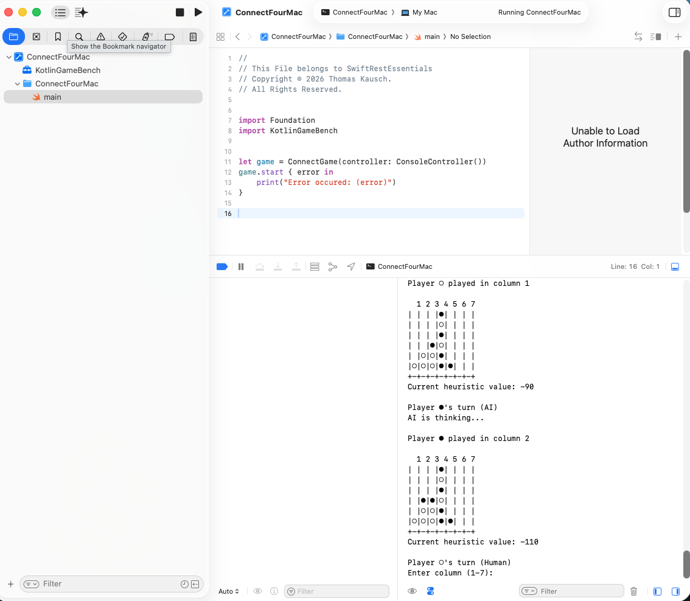

<p align="center">
  
</p>

# KotlinGameBench

[](https://github.com/tkausch/KotlinGameBench/actions/workflows/ci.yml)
[](LICENSE)
[](http://kotlinlang.org)
[](https://openjdk.org/)

A sophisticated game development framework in Kotlin, currently featuring a Connect Four implementation with an AI opponent powered by the minimax algorithm with alpha-beta pruning.

## 🎮 Game Features

- **Connect Four Implementation**: Complete Connect Four game with human vs AI gameplay
- **Minimax AI Algorithm**: AI uses minimax search with alpha-beta pruning for optimal moves
- **Heuristic Evaluation**: Strategic position evaluation favoring center columns
- **Interactive Console Interface**: Clean, visual board representation
- **Move Validation**: Comprehensive input validation and error handling
- **Undo Functionality**: Support for undoing moves (used internally by AI)
- **Extensible Framework**: Designed to support multiple game types through common interfaces


## 🏗️ Architecture

### Core Components

- **`Player`**: Enum representing game players (BLACK, WHITE)
- **`Move`**: Interface defining the contract for game moves with player information
- **`ConnectMove`**: Data class implementing Move with Connect Four specific move data
- **`SearchableBoard`**: Interface defining the contract for game boards used with SearchEngine
- **`ConnectBoard`**: Game board implementation with state management and win detection
- **`SearchEngine`**: Minimax algorithm implementation with alpha-beta pruning
- **`ConnectPlayer`**: Wrapper for AI move generation (formerly AIPlayer)
- **`AIGame`**: Main game controller for human vs AI gameplay

### Key Features

- **Optimized Win Detection**: O(1) winner checking around move positions
- **Heuristic Evaluation**: Column values `[10, 20, 50, 70, 50, 20, 10]` favoring center play
- **Configurable Search Depth**: Adjustable AI difficulty via search depth
- **Complete Game State Management**: Move history, undo support, ConnectBoard copying

## 🚀 Quick Start

### Prerequisites

- **Java 21** or higher (configured in build.gradle.kts)
- **Kotlin 2.3.10** (automatically managed by Gradle)
- **Gradle** (included via wrapper - version 9.2.1)

### Building and Running

```bash
# Clone or navigate to project directory
cd KotlinGameBench

# Build the project
./gradlew build

# Run the Connect Four game
./gradlew run
```

### Alternative Run Methods

```bash
# Build JAR and run directly
./gradlew build
java -cp build/libs/KotlinGameBench-1.0-SNAPSHOT.jar li.kausch.kgb.MainKt

# Or run JAR directly (if configured)
java -jar build/libs/KotlinGameBench-1.0-SNAPSHOT.jar
```

## 🍎 Using KotlinGameBench in Xcode

This framework can be integrated into macOS and iOS applications via XCFramework.

### Step 1: Build the XCFramework

```bash
# From the KotlinGameBench project directory
cd KotlinGameBench

# Build all framework components (iOS, iOS Simulator, macOS)
./gradlew buildXCFramework

# Create the complete XCFramework bundle
./gradlew createXCFramework
```

### Step 2: Verify Framework Creation

The `buildXCFramework` task builds framework binaries for:
- **iOS ARM64** (devices): `build/bin/ios/releaseFramework/KotlinGameBench.framework`
- **iOS Simulator**: `build/bin/iosSimulator/releaseFramework/KotlinGameBench.framework`
- **macOS ARM64**: `build/bin/mac/releaseFramework/KotlinGameBench.framework`

The `createXCFramework` task then combines these into a single XCFramework bundle:
- **Output**: `KotlinGameBench.xcframework`

### Step 3: Create a macOS/iOS Xcode Project

1. Launch Xcode
2. Create a new **macOS** or **iOS** project
3. Choose your preferred template (App, Tool, etc.)

### Step 4: Add XCFramework to Your Project

1. Locate `KotlinGameBench.xcframework` (created in Step 1)
2. Open your Xcode project
3. Select your project in the navigator
4. Go to **Build Phases** → **Link Binary With Libraries**
5. Click the **+** button and select **Add Files...**
6. Navigate to and select `KotlinGameBench.xcframework`
7. Verify it's added to your target

### Step 5: Adjust Library Validation Settings

To properly link the framework, adjust your build settings:

1. Select your project
2. Go to **Build Settings**
3. Search for **"Validate Built Product"**
4. Set **Validate Built Product** to **No** for Debug configuration

**Visual Reference:**


### Step 6: Add Code to Your Main

Import and use the framework in your Swift code:

```swift
import KotlinGameBench

// Initialize and use the game framework
let board = ConnectBoard()
let gameEngine = ConnectGameEngine()
let game = ConnectGame()

// Play the game
game.runConnectGame()
```

**Visual Reference:**


### Troubleshooting

- **Framework not found**: Ensure the XCFramework was built successfully and is in the correct location
- **Linker errors**: Verify that Validate Built Product is disabled
- **Runtime crashes**: Check that all framework dependencies are properly linked

## 🎯 How to Play

1. The game starts with an empty 6x7 ConnectBoard
2. **White player (○)** goes first (Human)
3. **Black player (●)** is the AI opponent
4. Enter column numbers 1-7 to drop your piece
5. First to get 4 pieces in a row (horizontal, vertical, or diagonal) wins!

### Game Interface

```
Welcome to Connect Four!
Players: ● (BLACK - AI) vs ○ (WHITE - Human)
Enter column numbers 1-7 to drop your piece when it's your turn

Initial ConnectBoard:
 1 2 3 4 5 6 7
| | | | | | | |
| | | | | | | |
| | | | | | | |
| | | | | | | |
| | | | | | | |
| | | | | | | |
+-+-+-+-+-+-+-+

Player ○'s turn (Human)
Enter column (1-7): 4
```

## 🤖 AI Configuration

### Difficulty Levels

The AI difficulty can be adjusted by modifying the search depth in `ConnectGame.kt`:

```kotlin
val aiMove = aiPlayer.getBestMove(board, currentPlayer, depth = 6)
```

| Depth | Difficulty | Performance |
|-------|------------|-------------|
| 3-4   | Beginner   | Very Fast   |
| 5-6   | Intermediate | Fast      |
| 7-8   | Advanced   | Moderate    |
| 9+    | Expert     | Slow        |

### Algorithm Details

- **Search Algorithm**: Minimax with alpha-beta pruning
- **Evaluation Function**: Position-based heuristic + terminal state detection
- **Optimization**: Early termination, move ordering, transposition-friendly
- **Time Complexity**: O(b^d) where b=7 (branching factor), d=depth

## 📊 Heuristic System

### Position Values

```
Column:  1   2   3   4   5   6   7
Value:  10  20  50  70  50  20  10
```

- **Center columns** (4,5) are most valuable
- **White maximizes** positive values
- **Black minimizes** (creates negative values)
- **Terminal states**: `Int.MAX_VALUE` (White wins) / `Int.MIN_VALUE` (Black wins)

### Example Evaluation

```kotlin
// White plays column 4: +70 points
// Black plays column 4: -70 points  
// White plays column 1: +10 points
// Current heuristic: 70 - 70 + 10 = 10
```


## 📝 License

This project is open source. Feel free to use, modify, and distribute.

## 🤝 Contributing

1. Fork the repository
2. Create a feature branch
3. Make your changes
4. Add tests if applicable
5. Submit a pull request

## ⚡ Performance Notes

- **Search Depth 6**: ~100,000 positions evaluated per move
- **Alpha-Beta Pruning**: ~10x speedup over basic minimax
- **Memory Usage**: Minimal - uses move/undo pattern
- **Response Time**: < 1 second for depth 6 on modern hardware

---

**KotlinGameBench** - A Kotlin game development framework 🎮

*Formerly "ConnectFourKotlin" - renamed to reflect the broader framework vision*
